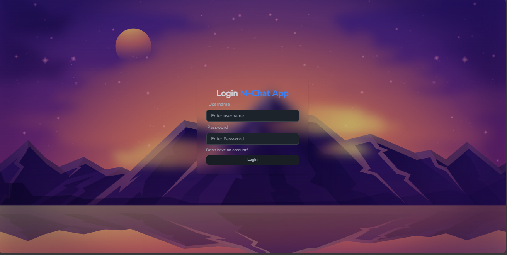

# MERN chat app Project-M


Some Features:

Tech stack: MERN + Socket.io + TailwindCSS + Daisy UI

### Setup .env file

```js
PORT=...
MONGO_DB_URI=...
JWT_SECRET=...
NODE_ENV=...
```

### Install Server Modules

```shell
npm install
```

### Install Client Modules

#### Step 1: cd into the client folder
```shell
cd frontend
```
#### Step 2: Install Node Modules
```shell
npm install
```

#### Step 3: cd back to the main folder
```shell
cd ..
```

### Start the app

```shell
npm run dev
```
